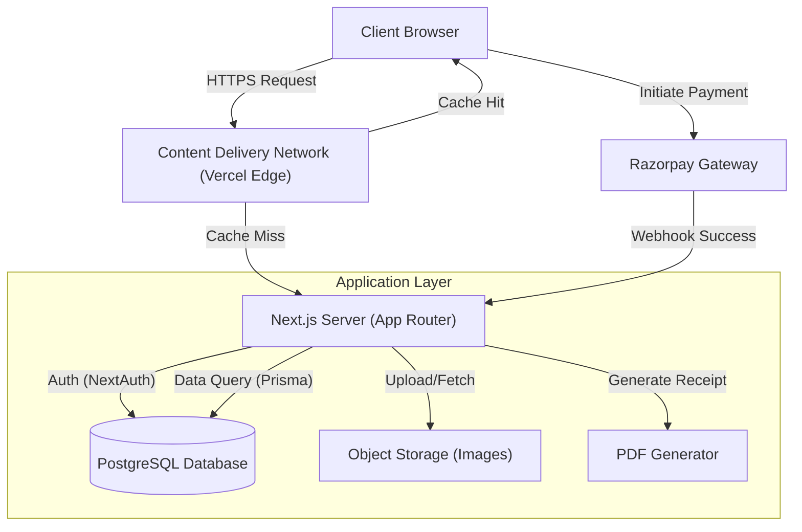

# System Architecture

## High-Level Architecture
The system follows a typical **Client-Server** model hosted within the Next.js ecosystem (Serverless Functions).

## Data Flow

### 1. User Visits Homepage
-   Client requests `/`.
-   Server fetches "Upcoming Events" from **Database**.
-   Server renders page with current Language (English/Kannada).

### 2. Administrator Adds Event
-   Admin logs in (NextAuth).
-   Uploads Event Image -> **Storage**.
-   Submits Event Details -> **Database** (via Server Action).
-   Homepage revalidates (ISR) to show new event immediately.

### 3. Donation Process
-   User fills Registration Form.
-   Data temporarily saved in Client State / Database (Pending).
-   User selects "Donate".
    -   **UPI**: Shows QR Code (Static/Dynamic).
    -   **Razorpay**: Opens Payment Modal.
-   On Success:
    -   Payment Gateway verifies transaction.
    -   Server updates Donation Record to "PAID".
    -   If Amount > 500:
        -   Server generates PDF.
        -   Server emails PDF to User.

## Database Schema (Draft)

### User
-   `id`: UUID
-   `role`: 'ADMIN' | 'USER'
-   `email`: String
-   `passwordHash`: String

### Event
-   `id`: UUID
-   `title_en`: String
-   `title_kn`: String
-   `description_en`: Text
-   `description_kn`: Text
-   `date`: DateTime
-   `imageUrl`: String

### Donation
-   `id`: UUID
-   `amount`: Float
-   `donorName`: String
-   `donorEmail`: String
-   `paymentId`: String (Razorpay ID)
-   `status`: 'PENDING' | 'SUCCESS' | 'FAILED'
-   `receiptSent`: Boolean
